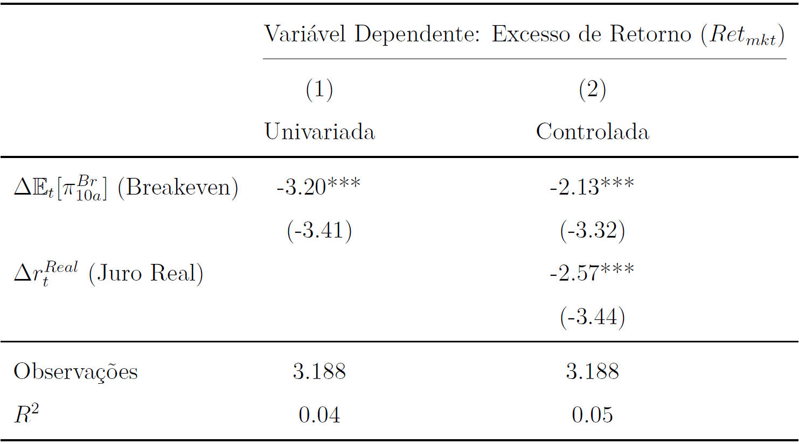
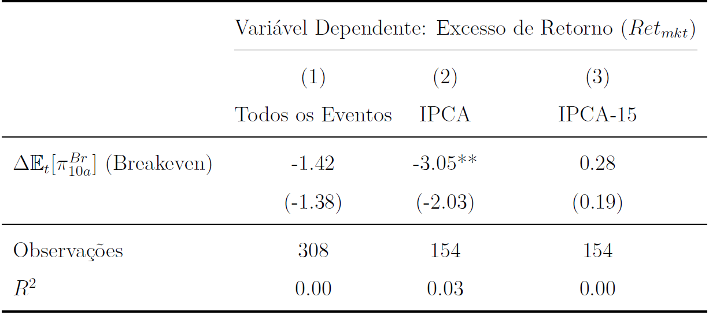
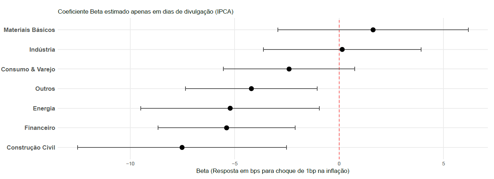

# Informações sobre o projeto

Esse artigo compreende à minha entrega final da disciplina *Empirical Asset Pricing* ministrada por Marcelo Fernandes na EESP/FGV. Abaixo segue o resumo, assim como alguns dos principais resultados. O artigo pode ser lido na íntegra no botão abaixo.

[Leia o Artigo Completo!](Expectativas_Inflacao_Sensibilidade_Mercado_Acionario_Brasileiro.pdf){.btn .btn-primary}

## Resumo do Artigo

Este artigo investiga a sensibilidade do mercado acionário brasileiro às expectativas de inflação, adaptando a metodologia de Chaudhary e Marrow (2022). Utilizando dados diários de inflação implícita e portfólios no período de 2010 a 2022, documenta-se uma relação diametralmente oposta à evidência norte-americana. Os resultados indicam que um aumento de 1 ponto-base nas expectativas está associado a uma queda de 3,2 pontos-base no excesso de retorno do mercado. Ao controlar pela taxa de juros real, demonstra-se que o canal de desconto é significativo, embora o conteúdo informacional inflacionário permaneça relevante. Adicionalmente, identifica-se reação do mercado exclusivamente nos dias de anúncio do índice oficial (IPCA), sendo estatisticamente nula nas prévias (IPCA-15). Setorialmente, o impacto negativo concentra-se em segmentos dependentes da demanda interna, enquanto setores exportadores apresentam maior resiliência aos choques. Em conjunto, os resultados sugerem que, no contexto brasileiro, choques nas expectativas de inflação são interpretados como sinal de deterioração macroeconômica.

### Exposição Diária das Ações Brasileiras às Expectativas de Inflação (2010-2022)

{width="80%"}

### Reação do Retorno das Ações a Choques de Inflação: Decomposição por tipo de anúncio

{width="80%"}

### Sensibilidade Setorial à Inflação (Dias de IPCA)

{width="80%"}

## Conclusões

Este artigo investiga a relação entre expectativas de inflação e retornos do mercado acionário
no Brasil utilizando dados diários entre 2010 e 2022. Adaptando a estratégia
empírica proposta por Chaudhary e Marrow (2022), analisamos como revisões nas expectativas
inflacionárias observadas no mercado financeiro estão associadas a variações
contemporâneas nos preços das ações.

Os resultados mostram uma relação negativa e estatisticamente significativa entre
revisões nas expectativas de inflação e retornos do mercado acionário brasileiro. Em particular,
estimamos que um aumento de 1 ponto-base nas expectativas de inflação de longo
prazo está associado a uma queda de aproximadamente 3,2 pontos-base no excesso de
retorno do mercado. Esse resultado permanece robusto quando controlamos pela variação
da taxa de juros real, sugerindo que revisões nas expectativas inflacionárias contêm
informação relevante para a precificação de ativos para além do canal tradicional da taxa
de desconto.

Também investigamos se essa relação é mais pronunciada em datas de divulgação de
indicadores de inflação. Os resultados indicam que a reação do mercado acionário é significativa
nos dias de divulgação do IPCA oficial, mas não nos dias de divulgação do
IPCA-15. Esse padrão sugere que os investidores respondem principalmente à divulgação
do índice oficial de inflação, que possui maior relevância institucional para contratos financeiros e decisões de política monetária na economia brasileira.

Por fim, a análise setorial revela heterogeneidade relevante na exposição à inflação
entre diferentes segmentos da economia. Setores mais dependentes da demanda doméstica
apresentam maior sensibilidade negativa a revisões nas expectativas inflacionárias,
enquanto setores com maior exposição internacional exibem respostas mais moderadas.

Em conjunto, os resultados sugerem que o conteúdo informacional das expectativas
de inflação para os preços de ativos depende do ambiente macroeconômico em que essas
expectativas são formadas. Enquanto evidências recentes para economias avançadas indicam
que aumentos na inflação esperada podem refletir boas notícias sobre crescimento
econômico, nossos resultados indicam que, no caso brasileiro, revisões altistas nas expectativas
inflacionárias são interpretadas predominantemente como sinais de deterioração
das condições macroeconômicas.

Pesquisas futuras podem explorar com maior profundidade os canais pelos quais choques
inflacionários afetam os preços de ativos em economias emergentes, bem como investigar
se a relação documentada neste artigo varia ao longo de diferentes regimes de
política monetária e condições macroeconômicas.