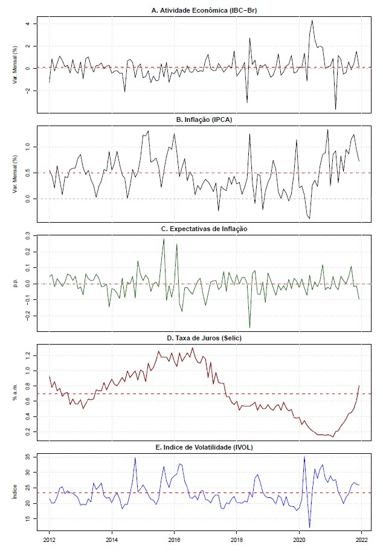
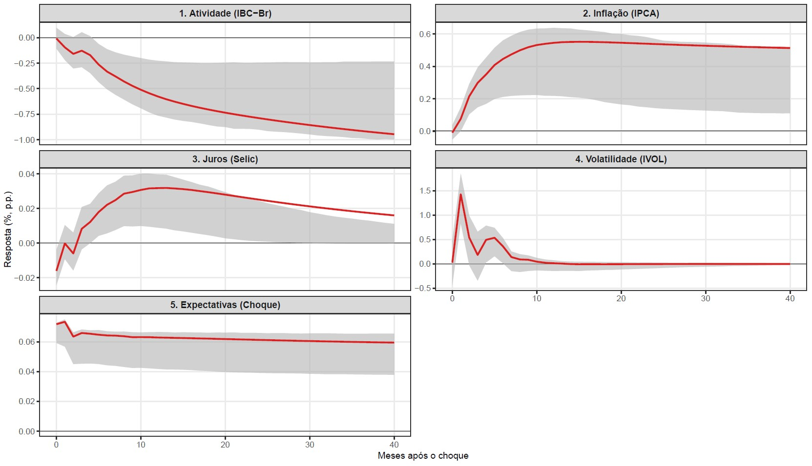
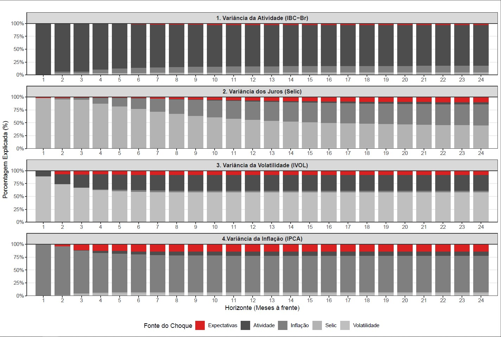

# Informações do Projeto

Esse trabalho apresenta minha entrega final para a disciplina de Séries Temporais Aplicadas à Macroeconomia e Finanças, ministrada pelo professor Guilherme Cagliari. A seguir apresento o resumo, gráficos dos principais resultados encontrados e conclusões.

É possível ler o artigo completo no botão abaixo:

[Leia o Artigo Completo!](reacao_macro_expectativas_inflacao.pdf){.btn .btn-primary}

## Resumo do Artigo

Este trabalho investiga como choques de expectativa de inflação afetam as variáveis nominais e reais da economia brasileira. Para esse objetivo, foi adaptada ao contexto brasileiro a metodologia de criação da variável de expectativa utilizando dados diários proposta por Chaudhary e Marrow (2022). Dessa forma, foi estimado um Vetor Autoregressivo (VAR) cujas funções impulso-resposta retratam a trajetória das variáveis macroeconômicas e financeiras ao choque condicionado aos dias de anúncio do IPCA. O resultado aponta uma reação contracionista, em que se observa queda do produto doméstico e alta persistência inflacionária, o que contrasta com o cenário americano e é compatível com a hipótese de desancoragem das expectativas. Adicionalmente, a Decomposição da Variância do Erro de Previsão (FEVD) aponta uma contribuição relevante das expectativas para o comportamento das variáveis nominais no longo prazo. Palavras-chave: Expectativa de Inflação. IPCA.

### Séries Temporais utilizadas no VAR (2012-2021)

{width="80%"}

### Funções Impulso-Resposta Acumuladas (Choque em Expectativas)

{width="80%"}

### Decomposição da Variância (FEVD)

{width="80%"}

## Conclusões

Este trabalho tinha como objetivo compreender como as variáveis macroeconômicas e
financeiras reagem a um choque de expectativa de inflação, atrelado aos anúncios do IPCA.
O resultado contrasta com o observado por Chaudhary e Marrow (2022), pois, enquanto no
cenário norte-americano o choque se traduz em uma trajetória positiva da economia, no cenário
brasileiro o choque se traduz em uma dinâmica das variáveis que resultam em uma trajetória
contracionista.

Os resultados apontam que um choque na expectativa de inflação está relacionado a um
aumento da inflação, com elevada inércia; um aumento defasado da taxa de juros; um pico que
rapidamente converge no caso do índice de volatilidade e um declínio em nível da atividade
econômica que se mantém no horizonte observado. Ademais, através da decomposição da
variância, ficou claro o papel das expectativas na influência do movimento da taxa de juros e da
inflação ao longo do tempo.

O trabalho possui diversas limitações, que podem ser aprimoradas em esforços posteriores:
Primeiro, a amostra de 2012 a 2021, escolhida devido à disponibilidade de dados, pode ser
considerada curta e é um período conturbado para a história econômica brasileira, marcado por
crises, o que pode distorcer a análise dos resultados, mesmo com os tratamentos realizados. É
necessária a busca por uma forma de mitigar essa restrição de disponibilidade de dados.

Segundo, a inflação implícita, proxy da expectativa de inflação utilizada neste trabalho,
não é uma medida isolada de surpresa, dado que esta carrega prêmios de risco e liquidez, o
que pode contaminar a análise dos resultados. Ademais, a agregação mensal dessa variável
necessita de maior robustez, provavelmente comparando com os resultados de choques utilizando
a expectativa de inflação do Boletim FOCUS.

Por fim, para trabalhos futuros, seria interessante aprofundar mais a hipótese de desancoragem
de expectativas levantada durante o texto e entender melhor como os investidores interpretam a
carga informacional de um choque de expectativa e os motivos por trás de seus comportamentos.